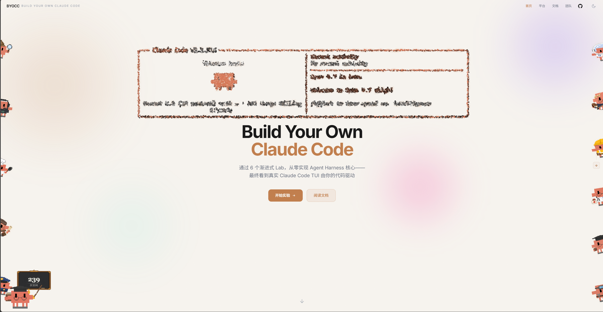
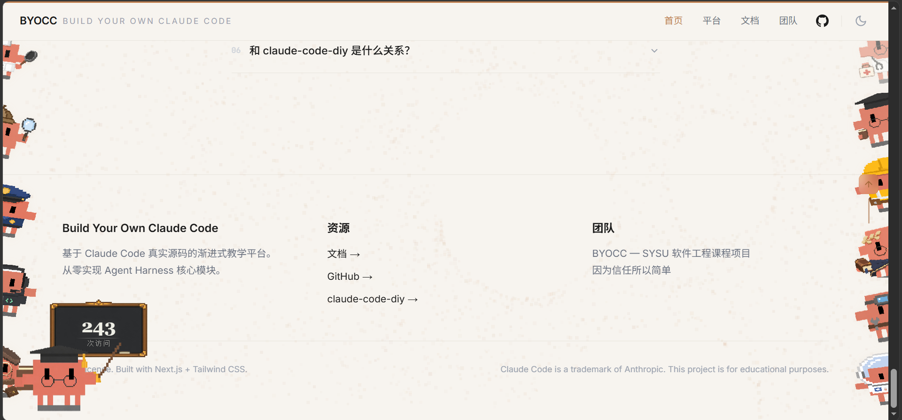
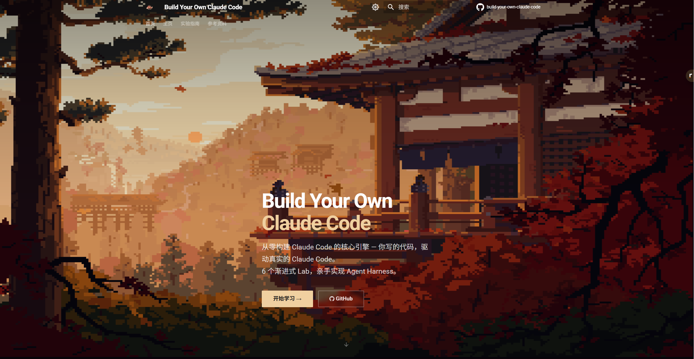
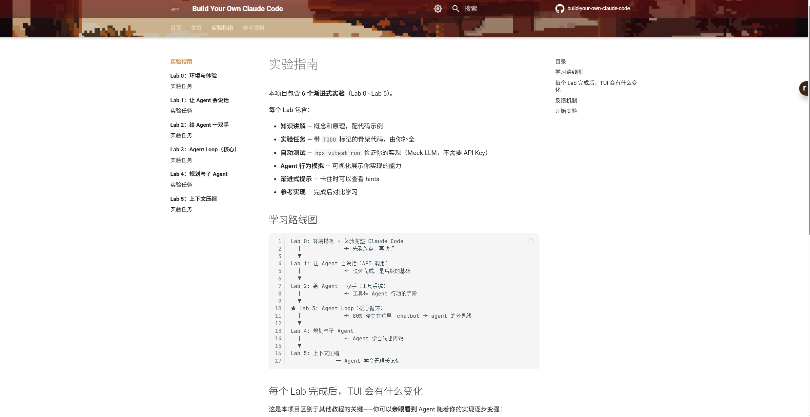

<div align="center">


# Build Your Own Claude Code

### 在网页里亲手搭出一个 Claude Code 风格的 Coding Agent

[](https://byocc.cc)
[](https://byocc.cc/labs/)
[](https://www.typescriptlang.org/)
[](#license)

[在线学习](https://byocc.cc) | [文档](https://cookiesheep.github.io/build-your-own-claude-code/) | [本项目位置](https://github.com/cookiesheep/build-your-own-claude-code) | [claude-code-diy](https://github.com/cookiesheep/claude-code-diy)|[FAQ](#faq)

</div>

## Why BYOCC?

Claude Code、Cursor Agent 这类 AI 编程工具的能力，不只来自大模型。模型负责理解意图和生成判断，而真正让它能读文件、改代码、跑命令、循环验证的，是外层的 **Agent Harness**：消息协议、工具系统、Agent Loop、规划机制和上下文管理。

**Build Your Own Claude Code（BYOCC）** 是一套渐进式网页实验教程。你不需要在本地克隆仓库、安装依赖或配置开发环境；打开网页后，就可以在浏览器里的文档、代码编辑器和终端中完成实验。每完成一个 Lab，Claude Code 风格 TUI 的能力都会发生可见变化。

- **网页端直接运行** — 在 `byocc.cc` 打开实验台，左侧读教程，右侧写代码和看终端反馈
- **基于真实 Claude Code 源码认知** — 教程来自对 Claude Code 真实系统的拆解，不是只会演示概念的玩具项目
- **6 个渐进式 Lab** — 从改 UI、消息协议、工具调用，到 Agent Loop、规划与上下文压缩
- **Lab 3 是核心** — 亲手实现 `observe -> think -> act -> repeat`，让 chatbot 变成真正的 agent
- **可见反馈** — 单元测试验证逻辑，TUI 展示你的实现让 Agent 获得了什么能力
- **无需 API Key 完成主线** — Mock LLM 测试保证结果稳定；需要真实模型体验时再接入平台提供的配置

## Preview

入口页面



彩蛋预览



教程主页



教程文档




## What You'll Learn

完成 6 个 Lab 后，你会理解一个 coding agent 从“能说话”到“能持续完成任务”的关键链路：

| Lab | 主题 | 你会实现 / 观察什么 | Agent 能力变化 |
|-----|------|---------------------|----------------|
| Lab 0 | 改出你的 Claude Code | 修改品牌、欢迎语和 TUI 可见元素 | 先看到真实产品如何被你的代码改变 |
| Lab 1 | 让 Agent 第一次开口 | Messages API、`role`、`content`、`Conversation` | Agent 能调用 LLM 并流式回复 |
| Lab 2 | 给 Agent 一双手 | 识别 `tool_use`，执行一轮工具并返回 `tool_result` | Agent 能读写或执行一次工具，但不会连续推理 |
| **Lab 3** | **Agent Loop** | `while(true)` 循环、工具结果回流、退出条件和最大迭代保护 | **Agent 能自主多轮调用工具直到任务完成** |
| Lab 4 | 规划与子 Agent | TodoWrite、任务状态、独立上下文的 Subagent | Agent 先计划再执行，并能拆分复杂任务 |
| Lab 5 | 上下文压缩 | `micro_compact`、`auto_compact`、三层压缩策略 | Agent 能处理更长任务，不被上下文窗口拖垮 |

## How It Works

BYOCC 的学习方式不是“读完一篇文章再想象系统怎么跑”，而是把知识讲解、代码填空、测试反馈和 TUI 观察放在同一个网页工作台里。

1. 打开 [byocc.cc](https://byocc.cc)。
2. 从 Lab 0 开始，阅读左侧教程。
3. 在网页编辑器里补全带 `TODO` 的代码。
4. 点击提交或在网页终端中运行验证。
5. 查看测试结果和 TUI 行为变化，再进入下一个 Lab。

用户侧不需要本地安装 Node.js、Docker 或 Claude Code，也不需要手动配置 API Key 才能完成主线实验。平台会把实验代码放入隔离环境中运行，并把结果显示回网页。

## Features

### Web Learning Platform

- 左侧教程、右侧代码编辑器和终端的实验台布局
- 每个 Lab 有独立知识讲解、实验任务、提示和验收标准
- 支持代码提交、构建反馈、进度记录和 TUI 行为观察
- 适合课堂演示、课程作业和自学打卡

### Agent Harness Curriculum

- 从 Messages API 开始，逐步接入工具系统和事件流
- 用 Lab 2 明确 `tool_use` 与 `tool_result` 的协议关系
- 用 Lab 3 抓住 Agent Loop 这个从 chatbot 到 agent 的分界线
- 用 Lab 4-5 继续补上真实 agent 必需的规划、子任务和上下文管理能力

### Realistic Feedback

- Mock LLM 驱动测试，避免网络和模型随机性影响学习
- TUI 可视化展示 Agent 能力变化
- 代码会进入 Claude Code 风格的运行链路，而不是停留在孤立代码片段

## FAQ

<details>
<summary><strong>我需要克隆这个仓库或在本地配置环境吗？</strong></summary>

不需要。学习者直接访问 <a href="https://byocc.cc">byocc.cc</a> 即可开始。教程、编辑器、终端和验证反馈都在网页端完成。

</details>

<details>
<summary><strong>这个项目是在教我使用 Claude Code，还是实现 Claude Code？</strong></summary>

它教的是 Claude Code 风格 coding agent 背后的核心机制。你会逐步实现消息协议、工具执行、Agent Loop、规划和上下文压缩这些 harness 能力，从而理解“模型之外的那一层系统”为什么重要。

</details>

<details>
<summary><strong>为什么 Lab 3 被标成核心？</strong></summary>

Lab 1 让 Agent 会说话，Lab 2 让 Agent 能执行一次工具，但它们还不是完整 agent。Lab 3 把工具结果重新喂回模型，并持续循环到任务完成，这就是 Agent Loop，也是聊天机器人和 coding agent 的关键分界线。

</details>

<details>
<summary><strong>没有 API Key 可以完成实验吗？</strong></summary>

可以。主线实验使用 Mock LLM 和确定性测试来验证你的实现。真实模型体验属于增强体验，平台会在需要时提供对应入口或说明。

</details>

<details>
<summary><strong>这个仓库里的代码有什么作用？</strong></summary>

这个仓库保存 BYOCC 网页平台、服务端、实验文档、Lab 骨架和共享类型。学习者入口是网页；仓库主要面向课程维护者和平台开发者。

</details>

## Documentation

- [实验指南](https://byocc.cc/labs/)：Lab 0-5 的完整学习路线
- [TypeScript 基础](https://byocc.cc/guide/typescript/)：读懂 skeleton 代码所需的语言知识
- [Messages API](https://byocc.cc/guide/messages-api/)：Lab 1 的协议背景
- [Tool Calling 原理](https://byocc.cc/guide/tool-calling/)：Lab 2 的工具调用背景
- [Agent Loop 详解](https://byocc.cc/guide/agent-loop/)：Lab 3 的核心循环背景
- [Claude Code 架构分析](https://byocc.cc/guide/claude-code-architecture/)：理解真实系统为什么比 demo 大得多

## Project Structure

```
├── docs/              # MkDocs 教程内容：Lab、Guide、About
├── platform/          # Next.js 网页学习平台：编辑器、终端、Lab 页面
├── server/            # Express 后端：会话、容器、提交、LLM proxy
├── labs/              # Lab skeleton / reference 相关代码
├── shared/            # 平台与实验共享 TypeScript 类型
├── infrastructure/    # Docker 与部署相关配置
└── internal/          # 架构、进度、设计决策和团队协作文档
```

<details>
<summary><strong>Architecture Overview</strong></summary>

```text
Browser
  ├─ Lab tutorial
  ├─ Monaco editor
  └─ Web terminal
        │
        ▼
Next.js platform
        │
        ▼
Express server
  ├─ Session / progress API
  ├─ Code submit API
  ├─ LLM proxy
  └─ Terminal WebSocket proxy
        │
        ▼
Isolated lab runtime
  ├─ Claude Code style source tree
  ├─ Lab skeleton files
  ├─ Mock LLM tests
  └─ TUI build / run feedback
```

BYOCC 的产品目标是让学习者留在浏览器里完成实验。底层平台负责创建隔离运行环境、注入学习者代码、执行验证，并把构建结果和 TUI 反馈返回网页。

</details>

## Contributing

欢迎改进课程内容、平台体验、Lab 任务和验证反馈。这个仓库主要面向 BYOCC 平台维护者；面向学习者的入口始终是 [byocc.cc](https://byocc.cc)。

在提交文档或代码改动时，请尽量保持一个 PR 聚焦一个主题，并确保 README、Lab 文档和平台实际行为的表述一致。
=======
# build-your-own-claude-code

[中文](#中文) | [English](#english)

---

# 中文

**从零构建一个 Coding Agent — 理解 AI 编程工具背后那 40% 的秘密。**

Claude Code、Cursor Agent 这些 AI 编程工具的能力 = 大模型 (60%) + Agent Harness (40%)。大模型提供智能，而 **harness** — 消息协议、工具系统、循环编排 — 才是让 agent 真正能完成复杂任务的关键。

本项目通过 **7 个渐进式实战任务**，带你亲手实现这个 harness。不是读文档，不是看视频，而是**像做 lab 一样写代码、跑测试、逐步搭建出一个真实可用的 coding agent**。

## 这个项目适合谁

- 想理解 AI Agent 内部原理的开发者
- 听说过 tool calling / function calling 但没实际实现过的人
- 想做一个 AI 方向的课程项目或练手项目的学生
- 用过 Claude Code / Cursor 想知道"它是怎么做到的"的人

## 你将构建什么

完成全部 7 个任务后，你会得到一个 **~800 行 TypeScript** 的 CLI coding agent：

- 用自然语言和它对话
- 它能读文件、写文件、执行命令
- 它能自主决定用哪个工具、何时停止
- 就像一个简化版的 Claude Code

## 学习路线

| Task | 主题 | 你将实现 | 难度 |
|------|------|---------|------|
| 1 | 消息协议 | 对话历史管理、消息类型定义 | ★☆☆☆☆ |
| 2 | LLM 客户端 | API 调用、流式响应、错误处理 | ★★☆☆☆ |
| 3 | 工具定义 | JSON Schema 描述工具、工具注册表 | ★★☆☆☆ |
| 4 | 核心工具 | 文件读写、Shell 执行 | ★★☆☆☆ |
| 5 | 工具执行引擎 | 解析 tool_use、路由执行、结果回传 | ★★★☆☆ |
| 6 | Agent 循环 | 核心 loop：思考→行动→观察→重复 | ★★★★☆ |
| 7 | 整合 | 组装完整 agent + CLI + System Prompt | ★★★★☆ |

每个 Task 包含：
- 📖 知识讲解（原理 + 代码示例）
- 📝 带 TODO 的骨架代码（你来补全）
- ✅ 自动化测试（补完代码，跑测试，全过就是做对了）
- 💡 渐进式提示（卡住时可以看 hints）
- 📋 参考实现（完成后对比学习）

## 快速开始

### 前置要求

- Node.js >= 18
- 基本的 TypeScript 知识

### 安装

```bash
git clone https://github.com/cookiesheep/build-your-own-claude-code.git
cd build-your-own-claude-code
npm install
```

### 开始 Task 1

```bash
# 阅读 Task 1 的知识讲解
cat tasks/task-01-messages/README.md

# 编辑骨架代码，补全 TODO
# （用你喜欢的编辑器打开 tasks/task-01-messages/src/messages.ts）

# 验证你的实现
npx vitest run tasks/task-01-messages/tests/
```

测试全部通过？恭喜，进入 Task 2！

### 运行完整的参考实现

```bash
# 配置 API Key
cp .env.example .env
# 编辑 .env 填入你的 Anthropic API Key

# 运行参考实现
npm start
```

## 项目背景

本项目源自团队对 Claude Code 源码的深入研究。通过 [claude-code-diy](https://github.com/cookiesheep/claude-code-diy) 项目，我们从 npm 包的 source map 中恢复并运行了 Claude Code 的完整源码（~1888 个 TypeScript 文件），从中理解了 agent harness 的核心架构，并将这些真实认知提炼为本教学项目。

## 项目结构

```
├── tasks/                    # 7 个学习任务
│   ├── task-01-messages/     #   每个任务含 README + skeleton + tests + solution
│   ├── task-02-llm-client/
│   ├── ...
│   └── task-07-integration/
├── src/                      # 参考实现（完整可运行的 agent）
├── shared/                   # 共享类型定义
├── docs/                     # 项目文档（PRD、架构、MVP 设计）
└── vitest.config.ts          # 测试配置
```

## 技术栈

| 类别 | 技术 |
|------|------|
| 语言 | TypeScript |
| 运行时 | Node.js >= 18 |
| 测试 | Vitest |
| LLM API | Anthropic SDK |

## Contributing

欢迎贡献！你可以：

- 改进现有 task 的文档和提示
- 添加新的 task（高级工具、安全机制、多模型适配等）
- 添加 Python 等其他语言版本
- 修复 bug 和改进测试

## License

MIT

---

# English

**Build a Coding Agent from Scratch — understand the "other 40%" behind AI coding tools.**

AI coding tools like Claude Code and Cursor Agent = LLM (60%) + Agent Harness (40%). The LLM provides intelligence, but the **harness** — message protocol, tool system, orchestration loop — is what makes agents actually capable of complex tasks.

This project teaches you to build that harness through **7 progressive, hands-on tasks**. Not reading docs. Not watching videos. **Writing code, running tests, and incrementally building a real, working coding agent.**

## Who Is This For

- Developers wanting to understand AI agent internals
- People who've heard of tool calling / function calling but never implemented it
- Students looking for an AI-related course project
- Users of Claude Code / Cursor wondering "how does it actually work?"

## What You'll Build

After completing all 7 tasks, you'll have a **~800-line TypeScript** CLI coding agent that:

- Chats with you in natural language
- Reads files, writes files, executes commands
- Autonomously decides which tools to use and when to stop
- Works like a simplified Claude Code

## Learning Path

| Task | Topic | What You'll Implement | Difficulty |
|------|-------|--------------------|------------|
| 1 | Messages | Conversation history, message types | ★☆☆☆☆ |
| 2 | LLM Client | API calls, streaming, error handling | ★★☆☆☆ |
| 3 | Tool Definition | JSON Schema tools, tool registry | ★★☆☆☆ |
| 4 | Core Tools | File read/write, bash execution | ★★☆☆☆ |
| 5 | Tool Execution | Parse tool_use, route & execute, return results | ★★★☆☆ |
| 6 | Agent Loop | Core loop: think → act → observe → repeat | ★★★★☆ |
| 7 | Integration | Assemble complete agent + CLI + system prompt | ★★★★☆ |

Each task includes:
- 📖 Knowledge guide (concepts + code examples)
- 📝 Skeleton code with TODOs (you fill in the blanks)
- ✅ Automated tests (pass all tests = task complete)
- 💡 Progressive hints (when you're stuck)
- 📋 Reference solution (compare after completing)

## Quick Start

```bash
git clone https://github.com/cookiesheep/build-your-own-claude-code.git
cd build-your-own-claude-code
npm install

# Start Task 1
cat tasks/task-01-messages/README.md
# Edit skeleton → run tests → repeat
npx vitest run tasks/task-01-messages/tests/
```

## Background

This project originates from the team's deep exploration of Claude Code source code via the [claude-code-diy](https://github.com/cookiesheep/claude-code-diy) project, where we recovered and ran the full source (~1888 TypeScript files) from npm source maps. The architectural insights from that hands-on experience form the foundation of this educational project.
>>>>>>> e3dca2dafd8225288226563b4dbcb573c9491c9b

## License

MIT
