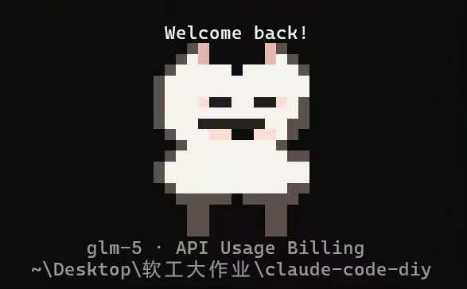
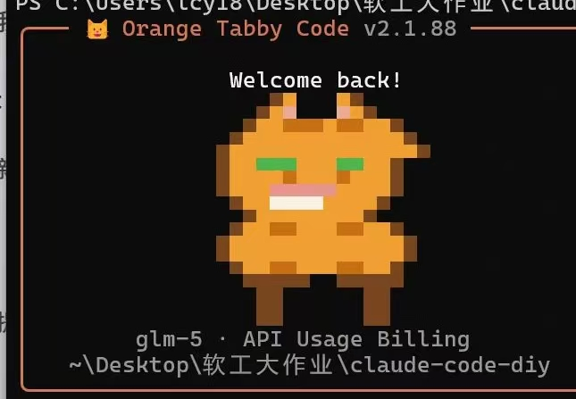
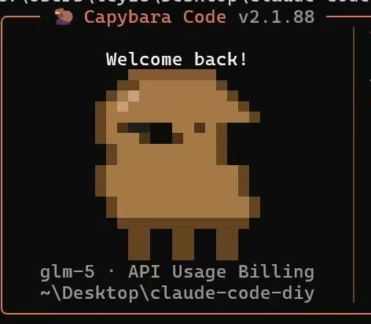

# Lab 0：实验任务

## 任务 1：自定义你的 Claude Code

!!! tip "这是 Lab 0 的核心任务——修改品牌外观，让 Claude Code 变成**你自己的**。"

### 1.1 理解 Lab 文件机制

`claude-code-diy` 的构建脚本 `build.mjs` 支持 `--lab` 参数。当你运行：

```bash
node build.mjs --lab=0
```

它会自动扫描所有带 `-lab0` 后缀的文件，用它们**替换**对应的原始文件进行编译。例如：

- `Clawd-lab0.tsx` 会覆盖 `Clawd.tsx` 的编译结果
- `WelcomeV2-lab0.tsx` 会覆盖 `WelcomeV2.tsx` 的编译结果
- 原始文件**不需要做任何改动**

这意味着你只需要修改 `-lab0` 文件，不会破坏原始代码。

### 1.2 修改欢迎语

打开 `claude-code-diy/src/components/LogoV2/WelcomeV2-lab0.tsx`：

```typescript
// 找到这一行：
const OWNER = "YOUR_NAME";
// 把 "YOUR_NAME" 换成你自己的名字，例如：
const OWNER = "小明";
```

保存后构建并运行（见下方「构建与验证」），你会在 TUI 顶部看到：

```
Welcome to 小明's claude-code v1.x.x
```

### 1.3 修改吉祥物颜色

打开 `claude-code-diy/src/components/LogoV2/Clawd-lab0.tsx`，找到 `COLOR_MAP`：

```typescript
const COLOR_MAP: Record<string, [number, number, number] | null> = {
  '.': null,
  'B': [120, 165, 210],  // 描边
  'W': [245, 245, 250],  // 羊毛 ← 改这里试试（当前是白色）
  'F': [235, 205, 190],  // 脸
  'E': [55, 75, 125],    // 眼睛
  'P': [225, 185, 155],  // 耳朵
};
```

每个颜色是一个 `[R, G, B]` 数组，取值 0-255。试试改几个值：

| 想要的颜色 | RGB 值 |
|-----------|--------|
| 红色 | `[255, 0, 0]` |
| 金色 | `[255, 215, 0]` |
| 绿色 | `[0, 200, 0]` |
| 蓝色 | `[70, 130, 180]` |
| 紫色 | `[180, 100, 255]` |
| 粉色 | `[255, 182, 193]` |

!!! example "试试看"

    把 `'W'`（羊毛颜色）从 `[245, 245, 250]` 改成 `[180, 100, 255]`（紫色），构建后看看吉祥物变成什么样。

### 1.4 修改品牌名

以下 4 个文件都有 `"YOUR_BRAND"` 占位符，把所有的 `"YOUR_BRAND"` 替换成你喜欢的品牌名：

| 文件 | 路径 | 改动位置 |
|------|------|---------|
| CondensedLogo-lab0.tsx | `src/components/LogoV2/` | 第 96 行 |
| LogoV2-lab0.tsx | `src/components/LogoV2/` | 第 256-257 行 |
| cli-lab0.tsx | `src/entrypoints/` | 第 43 行 |
| main-lab0.tsx | `src/` | 第 971 行、第 3811 行 |

例如，统一改成 `"🦊 My Agent"`：

```typescript
// CondensedLogo-lab0.tsx
t5 = "🦊 My Agent";
// LogoV2-lab0.tsx
const borderTitle = ` ${color("claude", userTheme)("🦊 My Agent")} ${color("inactive", userTheme)(`v${version}`)} `;
const compactBorderTitle = color("claude", userTheme)(" 🦊 My Agent ");
// cli-lab0.tsx
console.log(`${MACRO.VERSION} (🦊 My Agent)`);
// main-lab0.tsx
program.name('claude').description(`🦊 My Agent - starts an interactive session by default...`)
// ...
.version(`${MACRO.VERSION} (🦊 My Agent)`, '-v, --version', 'Output the version number');
```

### 1.5 选择你的吉祥物

打开 `claude-code-diy/src/components/LogoV2/Clawd-lab0.tsx`，找到 `EYES`、`BASE_GRID` 和 `COLOR_MAP` 三个部分。

从下面三套吉祥物中**选一个你喜欢的**，把对应的代码复制进去，替换掉原有的 TODO 内容。

#### 方案 A：萨摩耶（白色、粉笑嘴）



```typescript
type EyeVariant = { row5: string };
const EYES: Record<string, EyeVariant> = {
  default:     { row5: '..BWWWFEEWWEEFWB...' },
  'look-left': { row5: '..BWWFEE.WWEEFWB...' },
  'look-right':{ row5: '..BWWWFEEWW.EEWWB..' },
  'arms-up':   { row5: '..BWWWFEEWWEEFWB...' },
};
const BASE_GRID = [
  '.....BP.....PB.....', // 0 ear tips
  '....BWP.....PWB....', // 1 ear inner
  '...BWWWWW.WWWWWB...', // 2 head top
  '..BWWWWWWWWWWWWW...', // 3 head
  '..BWWWWWWWWWWWWW...', // 4 head wide
  '..BWWWFEEWWEEFWB...', // 5 eyes (replaced per pose)
  '..BWWWWWWWWWWWWB...', // 6 under eyes
  '..BWWWNNNNNNWWBB...', // 7 nose
  '...BWWWFF..FFWB....', // 8 smile
  '....BWWWWWWWWB.....', // 9 chin
  '...BWWWWWWWWWWBB...', // 10 chest
  '..BWWWWWWWWWWWWW...', // 11 body
  '..BWWWWWWWWWWWWW...', // 12 body
  '...BWWWWWWWWWWBB...', // 13 body lower
  '....BBBBB.BBBBB....', // 14 leg join
  '.....BB.....BB.....', // 15 legs
  '.....BB.....BB.....', // 16 legs
  '.....BB.....BB.....', // 17 feet
];
const COLOR_MAP: Record<string, [number, number, number] | null> = {
  '.': null,
  'B': [90, 80, 75],     // dark outline
  'W': [245, 243, 238],  // white fur
  'E': [30, 30, 30],     // black eyes
  'N': [40, 35, 30],     // black nose
  'P': [235, 180, 175],  // pink inner ear
  'F': [255, 220, 210],  // pink smile
};
```

同时修改 `renderSheep` 函数中的眼睛行号：

```typescript
grid[5] = EYES[pose].row5;  // 改为 row5
```

arms-up 耳朵行：

```typescript
grid[0] = '....BPB.....BPB....';
```

品牌名设为 `"🐕 Samoyed Code"`。

---

#### 方案 B：橘猫（橘色、绿眼、条纹）



```typescript
type EyeVariant = { row5: string };
const EYES: Record<string, EyeVariant> = {
  default:     { row5: '..BOOEEEOOOEEOOB...' },
  'look-left': { row5: '..BOEEOEOOOEEOOB...' },
  'look-right':{ row5: '..BOOEEEOOOEOEOB...' },
  'arms-up':   { row5: '..BOOEEEOOOEEOOB...' },
};
const BASE_GRID = [
  '......BO...OB......', // 0 ear tips
  '.....BOP...POB.....', // 1 ears
  '....BOOSSSOSSOOB...', // 2 head top with tabby M stripe
  '...BOOOOOOOOOOOOB..', // 3 head
  '..BOOOOOOOOOOOOOOB.', // 4 head wide
  '..BOOEEEOOOEEOOB...', // 5 big eyes (replaced per pose)
  '..BOOOOSOOOSOOOB...', // 6 stripes on face
  '..BOOONNNNNOOOOB...', // 7 nose
  '...BOOWWWWOOOOB....', // 8 white chin
  '....BOOOOOOOOB.....', // 9 neck
  '...BOOSSOOOSSOOB...', // 10 body with stripes
  '..BOOOOOOOOOOOOOB..', // 11 body
  '..BOOOOOOOOOOOOOB..', // 12 body
  '...BOOSSOOOSSOOB...', // 13 body with stripes
  '....BBBBB..BBBBB...', // 14 legs top
  '.....BB......BB....', // 15 legs
  '.....BB......BB....', // 16 legs
  '.....BB......BB....', // 17 feet
];
const COLOR_MAP: Record<string, [number, number, number] | null> = {
  '.': null,
  'O': [240, 160, 50],  // orange fur
  'S': [200, 110, 20],  // dark stripes
  'B': [120, 70, 30],   // brown outline
  'E': [80, 180, 80],   // green eyes
  'N': [230, 150, 140], // pink nose
  'P': [235, 170, 150], // pink inner ear
  'W': [250, 240, 230], // white chin
};
```

眼睛行号：

```typescript
grid[5] = EYES[pose].row5;
```

arms-up 耳朵行：

```typescript
grid[0] = '....BO...OB...OB...';
```

品牌名设为 `"🐱 Orange Tabby Code"`。

---

#### 方案 C：水豚（棕色、圆脸、小眼睛）



```typescript
type EyeVariant = { row5: string };
const EYES: Record<string, EyeVariant> = {
  default:     { row5: '..OBNEE..BBNBO.....' },
  'look-left': { row5: '..OBN.EE.BBNBO.....' },
  'look-right':{ row5: '..OBNEE..B.BNBO....' },
  'arms-up':   { row5: '..OBNEE..BBNBO.....' },
};
const BASE_GRID = [
  '.....HHHHHHHH......', // 0 top of head
  '....OOBBBBBBBO.....', // 1 head top outline
  '...OBIBBBBBBBBO....', // 2 head with ears
  '..OBIBBBBBBBBBBO...', // 3 head wide
  '..OBBBBBBBBBBBBBO..', // 4 head body transition
  '..OBNEE..BBNBO.....', // 5 eyes & nose (replaced per pose)
  '..OBBBN..NBBBO.....', // 6 nose & mouth
  '...OBBBBBBBBBO.....', // 7 chin
  '...OBBBBBBBBBO.....', // 8 neck
  '..OBBBBBBBBBBBBO...', // 9 body start
  '..OBBBBBBBBBBBBO...', // 10 body
  '..OBBBBBBBBBBBBO...', // 11 body
  '...OBBBBBBBBBBBBO..', // 12 body wide
  '...OBBBBBBBBBBBBO..', // 13 body lower
  '....OOOOOOOOOOOO...', // 14 leg join
  '.....OO..OO..OO....', // 15 legs
  '.....OO..OO..OO....', // 16 legs
  '.....OO..OO..OO....', // 17 feet
];
const COLOR_MAP: Record<string, [number, number, number] | null> = {
  '.': null,
  'O': [101, 67, 33],   // dark brown outline
  'B': [165, 120, 70],  // brown body
  'N': [80, 50, 25],    // dark nose
  'E': [30, 30, 30],    // black eyes
  'I': [200, 160, 120], // light inner ear
  'H': [130, 90, 50],   // darker head top
};
```

眼睛行号：

```typescript
grid[5] = EYES[pose].row5;
```

arms-up 耳朵行：

```typescript
grid[0] = '....HH..HH..HH.....';
```

品牌名设为 `"🦫 Capybara Code"`。

---

!!! tip "选好之后"

    1. 把上面的 `EYES`、`BASE_GRID`、`COLOR_MAP` 复制到 `Clawd-lab0.tsx`，替换掉原有的 TODO 部分
    2. 别忘了也修改 `renderSheep` 里的眼睛行号（`grid[6]` → `grid[5]`）和 arms-up 耳朵行
    3. 在 1.4 的品牌名文件中，把 `YOUR_BRAND` 改成对应的品牌名（如 `"🐕 Samoyed Code"`）
    4. 构建 → 运行 → 看到你的专属 Agent！

### 1.6 构建与验证

每次修改后，都需要重新构建才能看到效果：

```bash
cd claude-code-diy

# 安装依赖（只需要一次）
npm install

# 用 Lab 0 模式构建（会自动使用 *-lab0 文件）
node build.mjs --lab=0

# 启动 TUI
node cli.js
```

!!! success "你应该看到"

    1. **欢迎语**变成了 `Welcome to 小明's claude-code`
    2. **吉祥物**换上了你选的颜色
    3. **边框标题**显示你的品牌名（如 `🦊 My Agent`）
    4. 运行 `node cli.js --version` 显示你的品牌名

!!! warning "如果构建失败"

    - 确认你在 `claude-code-diy` 目录下（不是 `build-your-own-claude-code`）
    - 确认已经运行过 `npm install`
    - 检查你修改的文件是否有语法错误（括号、引号是否匹配）

## 思考题

1. 当你在 Claude Code 中说"帮我写一个 hello.js"时，系统内部发生了什么？尝试画出数据流。
2. `build.mjs --lab 0` 是怎么找到 `-lab0` 文件并替换原始文件的？如果同时有 `Clawd-lab0.tsx` 和 `Clawd-lab1.tsx`，它怎么知道用哪个？
3. Agent Loop 什么时候应该终止？列出你能想到的所有情况。
