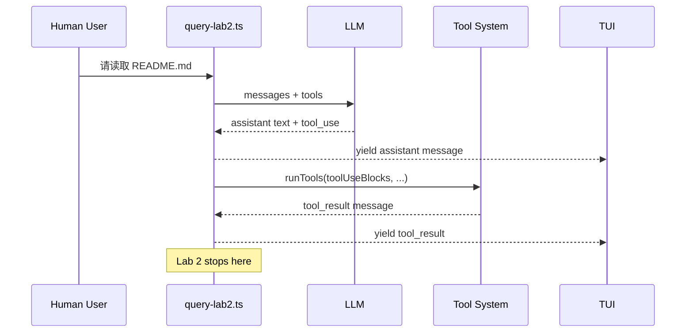

# Lab 2：给 Agent 一双手

!!! tip "这一关不是让你从零造工具，而是让你看懂 Agent 什么时候该把 LLM 的意图变成真实动作。"

Lab 1 让 Agent 第一次开口：用户输入 -> LLM -> 文本回复。Lab 2 往前接一段：当 LLM 说"我想读文件"时，Agent Harness 要识别这个 `tool_use`，执行一次工具，并把结果展示给 TUI。

这一关完成后，你的 Agent 会获得第二种能力：**能执行一轮工具调用**。但它还没有 Lab 3 的 Agent Loop，所以它不会根据工具结果继续下一轮推理。

## 你会学到什么

1. 理解 `tool_use` 是 LLM 发出的工具意图，不是工具执行结果。
2. 在真实 Claude Code 的 `query()` 流程中扫描 assistant message 的 content blocks。
3. 调用已有的 `runTools()` 编排器执行工具，而不是重写 ToolRegistry。
4. 把工具执行结果 yield 给 TUI，让用户看到 Agent 真的在做事。
5. 收集 `tool_result` 消息，为 Lab 3 的多轮循环做准备。
6. 观察 Lab 2 Agent 的能力边界：能动手一次，但不会连续行动。

## Lab 2 的学习节奏

你会先观察一段真实行为，再逐步写代码：

```text
看真实行为
  -> 标注 tool_use 和 tool_result 的位置
  -> 补全 query-lab2 的关键代码片段
  -> 实现 tool_use 收集
  -> 实现 runTools() 单轮执行
  -> 跑构建和 TUI
  -> 观察：Agent 为什么只做一步就停
```

整个 Lab 2 的节奏和 Lab 1 一样，都是**从具体到抽象**。你不会一开始就面对完整的 `query.ts`。你先观察"读 README.md"这种任务在协议层面发生了什么，然后再把这个规律放回 `query-lab2.ts`。

```text
I.  看     -> 观察 Lab 1 与 Lab 2 的行为差异
II. 标注   -> 找出 assistant message 里的 tool_use
III. 填空  -> 补全 if 判断、filter、runTools 参数
IV. 实现   -> 在 query-lab2.ts 里完成 TODO 5-8
V. 验证   -> build + TUI 观察工具结果
VI. 反思   -> 为什么工具结果出现了，Agent 仍然不继续
```

## 一段真实工具调用的协议形状

Lab 2 关注的是这段流程中的中间两步：

```text
[User] "请读取 README.md 第一行"

[Assistant]
  text: "好的，我来读取 README.md。"
  tool_use: Read({ file_path: "README.md" })

[Harness]
  发现 tool_use
  调用 runTools()
  执行 Read

[User]
  tool_result: "README.md 的文件内容..."

Lab 2 到这里停止。
```

最容易误会的是最后一句：**Lab 2 到这里停止**。

工具结果已经出现了，但它还没有被重新喂给 LLM。也就是说，Lab 2 的 Agent 做到了"读文件"，但还做不到"读完文件后根据内容继续找下一个文件"。后者需要 Lab 3 的 `while (true)` Agent Loop。

## 为什么不是重写工具系统？

Lab 2 不要求你实现 `Read`、`Write`、`Bash` 或 `ToolRegistry`。这些在 Claude Code 里已经存在。

本项目的核心不是从零写一个玩具 Agent，而是挖空真实 Claude Code 的关键路径。Lab 2 要你补的是 Harness 中更核心的一段：

```text
assistant message
  -> 找 tool_use block
  -> runTools()
  -> yield tool_result
  -> 暂停
```

| 组件 | Lab 2 要不要写 | 原因 |
|------|----------------|------|
| 工具定义 | 不写 | Claude Code 已经有完整工具系统 |
| 工具权限 | 不写 | 通过 `canUseTool` 和上下文传入 |
| 工具执行 | 不重写 | 使用已有 `runTools()` |
| 工具请求检测 | 要写 | 这是 query 主流程的关键缺口 |
| 工具结果收集 | 要写 | Lab 3 循环需要它 |

## 消息流图



## Lab 2 的能力边界

完成 Lab 2 后，Agent 应该能：

- 接收用户输入。
- 调用底层 LLM。
- 识别 assistant message 里的 `tool_use`。
- 执行一轮工具。
- 在 TUI 中展示工具结果。

它还不能：

- 根据工具结果继续调用 LLM。
- 自动完成多步任务。
- 在 `while (true)` 循环里持续执行"模型 -> 工具 -> 结果 -> 模型"。

所以当你在 TUI 输入：

```text
读取 README.md，然后根据里面的说明找到配置文件
```

Lab 2 的正确观察不是"它应该完整完成任务"，而是：

```text
Agent 会执行第一轮工具，例如读取 README.md。
但它不会把 README.md 的结果再发回 LLM 继续推理。
因为 Lab 2 只有单轮工具执行，Lab 3 才会实现 Agent Loop。
```

!!! success "你真正完成了什么"

    你给 Agent 接上了第一只"手"。它能把 LLM 的工具意图变成真实动作；下一步，Lab 3 会让它学会连续行动。

## 实验任务

详见 [实验任务](./tasks.md)。
