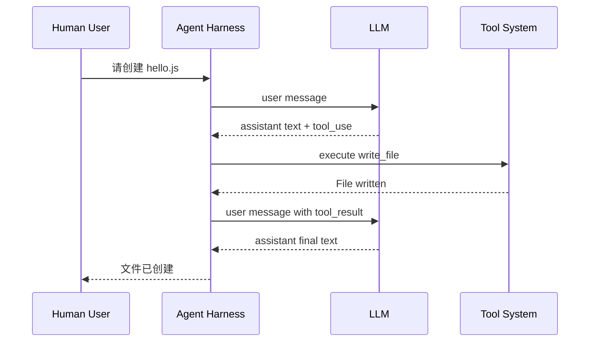

# Lab 1：让 Agent 第一次开口

!!! tip "这一关不是让你背 API 字段，而是让你看懂 Agent 和 LLM 之间怎么说话。"

Lab 0 让你先看到一个完整 Claude Code 风格的 TUI。Lab 1 往回拆一层：当用户输入一句话，Agent 到底把什么发给 LLM？LLM 又把什么还回来？

这一关完成后，你的 Agent 会获得第一种能力：**能把用户输入交给 LLM，并把回复流式展示出来**。但它还没有工具能力，所以它不能读文件、写文件、执行命令，也还没有 Lab 3 的 Agent Loop。

## 你会学到什么

1. 理解 Anthropic Messages API 的消息格式。
2. 区分 `role`、`content` 和 `ContentBlock`。
3. 看懂 `text`、`tool_use`、`tool_result` 三种核心 block。
4. 明白最反直觉的一点：`tool_result` 的 `role` 是 `"user"`，但它不是人类用户发的。
5. 在真实 `query-lab1.ts` 变体里接通 LLM 流式回复。
6. 观察 Lab 1 Agent 的能力边界：会说话，但不会动手做事。

!!! note "关于 thinking block"

    真实 Claude / Claude Code 还可能出现 `thinking` 相关结构，但 Lab 1 的主线先聚焦 `text`、`tool_use`、`tool_result`。等你理解消息协议后，再看 thinking、planning、compaction 会轻松很多。

## Lab 1 的学习节奏

你会先看一段真实对话，再一步步把它拆开：

```text
看真实对话
  -> 标注 role 和 block
  -> 补全 JSON
  -> 进入 query-lab1.ts
  -> 补全 system prompt / messages / callModel / completed
  -> 提交构建
  -> 在 TUI 里观察：Agent 现在还不能读文件
```

别被真实源码吓到。你不会一开始就面对完整的 `query.ts`，右侧只会打开精简过的 `query-lab1.ts`。

整个 Lab 1 的节奏是**从协议到源码**：你先看一段真实的 Agent 对话，像读聊天记录一样标注它；然后补全几段 JSON，确认自己理解 role 和 content block；最后把这个理解放回真实运行路径，补全 `query-lab1.ts` 里的最短 LLM 调用链。

最后一小步是构建、看 TUI，亲眼确认：你的 Agent 会说话了，但还没有“手”。

```
I.  看     →  读一段带注释的真实对话，理解每条消息为什么存在
II.  标注   →  选择题：识别、推理、预测，确认你理解了 role 和 block
III. 填空   →  补全不完整 JSON（你只需要填几个空）
IV.  源码   →  打开 src/query-lab1.ts，看到真实 query() 的精简版本
V.  实现   →  补全 system prompt、messages、deps.callModel 和 completed
VI.  构建   →  提交后运行 build.mjs --lab 1，替换真实 query.js
VII. 观察  →  启动 TUI，确认 Agent 能说话但不能做事
```

## 一段真实对话的协议形状

先看一个完整的工具调用对话。Lab 1 暂时不会真正执行工具，但你需要先理解协议长什么样：

```text
[User] "帮我创建 hello.js"

[Assistant]
  text: "好的，我来创建这个文件。"
  tool_use: write_file({ path: "hello.js", content: "console.log('hello')" })

[User]
  tool_result: "File written successfully"

[Assistant]
  text: "文件已创建。"
```

这段对话里最容易误会的是第三条：

```typescript
{
  role: "user",
  content: [
    {
      type: "tool_result",
      tool_use_id: "toolu_01",
      content: "File written successfully"
    }
  ]
}
```

它的 `role` 是 `"user"`，但它不是人类用户发的。它是 Harness 执行工具后，自动构造出来、塞回 LLM 上下文的消息。

### 为什么 `tool_result` 是 user？

可以用三层视角理解：

| 视角 | 解释 |
|------|------|
| API 协议 | Messages API 的对话消息主要在 `user` 和 `assistant` 两个 role 之间轮流出现。工具结果是下一轮输入，所以放在 `user` 消息里。 |
| Harness | LLM 只提出 `tool_use` 意图，真正执行工具的是 Harness。Harness 执行完后，把结果包装成 `tool_result`。 |
| 对话历史 | LLM 下一轮推理必须看到工具结果，所以 `tool_result` 要追加进 `messages` 数组。 |

!!! warning "核心原则"

    `tool_result` 的 `role` 是 `"user"`，但含义不是“人类用户说了这句话”。更准确地说，它代表“外部世界给模型的新输入”。

### 常见误解

**误解 1："工具结果应该有 `role: "tool"`"**

不少其他 LLM API（比如 OpenAI）确实用 `role: "tool"` 表示工具结果。但 Anthropic Messages API 的设计不同：对话只在 `user` 和 `assistant` 两个角色之间轮转。工具结果是"给模型的新输入"，所以它必须是 `user`。

记住：这里 `user` 的含义不是"人类用户"，而是"模型外部世界的输入"。

**误解 2："assistant 发出 tool_use 后，应该自己继续说下去"**

LLM 不能自己执行工具。它只能提出意图（`tool_use`），然后停下来（`stop_reason: "tool_use"`）。真正执行工具的是 Harness（你的代码）。Harness 执行完后，把结果包装成 `tool_result`，追加到 `messages`，再发回给 LLM——这时 LLM 才会"继续说"。

整个过程就像在餐厅点菜：你告诉服务员想吃什么（`tool_use`），服务员去厨房下单（Harness 执行工具），菜做好了端回来（`tool_result`），然后你继续用餐。

**误解 3："tool_use 和 tool_result 不需要对应"**

`tool_use` 的 `id` 字段和 `tool_result` 的 `tool_use_id` 字段必须严格对应。原因很简单：一条 assistant 消息里可能同时调用多个工具（比如同时读两个文件）。如果 `tool_result` 不标注自己回答的是哪个 `tool_use`，LLM 就无法把结果和意图匹配起来。

```text
assistant: [
  tool_use { id: "toolu_01", name: "read_file", input: { path: "a.js" } }
  tool_use { id: "toolu_02", name: "read_file", input: { path: "b.js" } }
]

user: [
  tool_result { tool_use_id: "toolu_01", content: "// file a" }  ← 对应第一条
  tool_result { tool_use_id: "toolu_02", content: "// file b" }  ← 对应第二条
]
```

如果 `tool_use_id` 写错了，LLM 会把结果和意图搞混，可能产生完全错误的回复。

## 消息流图



Lab 1 先让你实现 `Human -> Harness -> LLM -> Harness -> Human` 这条语言通道。真正的 `Tool System` 会在 Lab 2 才接上。

## 底层 LLM 从哪里来？

Lab 代码不应该硬编码 API Key，也不应该把某个模型写死在代码里。

在平台里，底层 LLM 通常来自用户或平台环境配置：

- 用户在平台设置自己的 API Key。
- 平台后端把可用的 LLM 配置注入实验环境。
- 本地运行时可以用 `ANTHROPIC_API_KEY`、`ANTHROPIC_BASE_URL` 或项目约定的环境变量。

Lab 1 的重点不是“管理密钥”，而是理解：`query-lab1.ts` 会接收 TUI 传入的消息历史，把它交给底层 LLM，再把流式回复 `yield` 回 TUI。

## Lab 1 的能力边界

完成 Lab 1 后，Agent 应该能：

- 接收用户输入。
- 调用底层 LLM。
- 流式展示模型文本回复。
- 通过 `query-lab1.ts` 使用 TUI 传入的消息历史。

它还不能：

- 读取文件。
- 写入文件。
- 执行 shell 命令。
- 真的处理 `tool_use`。
- 在 `while (true)` 循环里持续执行“模型 -> 工具 -> 结果 -> 模型”。

所以当你在 TUI 输入：

```text
请读取 README.md 第一行
```

Lab 1 的正确观察不是“它应该真的读出来”，而是：

```text
Agent 会尝试用文字回应，但它现在还不能读取文件。
因为 Lab 1 还没有工具执行能力，读文件会在 Lab 2 才实现。
```

!!! success "你真正完成了什么"

    你让 Agent 第一次“开口”了。它已经能和 LLM 通话，也能保存上下文；下一步，Lab 2 会给它接上工具，让它开始真的做事。

## 实验任务

详见 [实验任务](./tasks.md)。
