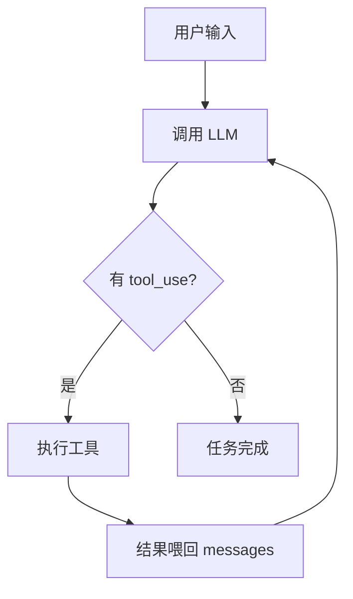

# AI Agent 上下文文档 — 文档站 + 测试基础设施 + CI

> 把这份文档发给你的 AI 工具（Codex、Copilot、ChatGPT 等），它就能理解整个项目并帮你完成任务。

---

## 项目概览

**项目名称**：Build Your Own Claude Code (BYOCC)

**一句话介绍**：渐进式教学平台，学习者通过 6 个 Lab 实现 AI Agent 核心模块。你负责文档完善、测试基础设施和 CI/CD。

## 你的三大职责

### 职责 1：完善文档站内容

文档站已部署：https://cookiesheep.github.io/build-your-own-claude-code
技术：Material for MkDocs（Python），源文件在 `docs/` 目录。

**重点工作**：

Lab 3 的文档是最重要的（`docs/labs/lab-03/index.md`），需要包含：
- Agent Loop 概念讲解（chatbot vs agent）
- Mermaid 流程图
- Claude Code 真实代码对应位置
- 常见陷阱说明

同时完善：
- `docs/guide/agent-loop.md` — 背景知识参考
- `docs/guide/typescript.md` — 补充 async generator/yield 教学
- `docs/about/faq.md` — 常见问题（5+ 个 Q&A）

### 职责 2：测试基础设施

创建 `labs/shared/` 目录，放公共测试工具：

```
labs/shared/
├── mock-llm.ts       ← 共享 Mock LLM（与方向 C 协调）
└── test-helpers.ts   ← 辅助函数
```

test-helpers.ts 内容：
```typescript
// 收集 AsyncGenerator 所有事件
export async function collectEvents<T>(gen: AsyncGenerator<T>): Promise<T[]> {
  const events: T[] = [];
  for await (const event of gen) events.push(event);
  return events;
}

// 收集特定类型的事件
export async function collectEventsByType<T extends { type: string }>(
  gen: AsyncGenerator<T>, type: string
): Promise<T[]> {
  const all = await collectEvents(gen);
  return all.filter(e => e.type === type);
}
```

确认 `vitest.config.ts` 的 include 覆盖 `labs/**/tests/**/*.test.ts`（已完成）。

### 职责 3：GitHub Actions CI

创建 `.github/workflows/ci.yml`：

```yaml
name: CI
on:
  push:
    branches: [main]
  pull_request:
    branches: [main]

jobs:
  typecheck:
    runs-on: ubuntu-latest
    steps:
      - uses: actions/checkout@v4
      - uses: actions/setup-node@v4
        with: { node-version: 18 }
      - run: npm ci
      - run: npx tsc --noEmit

  test:
    runs-on: ubuntu-latest
    steps:
      - uses: actions/checkout@v4
      - uses: actions/setup-node@v4
        with: { node-version: 18 }
      - run: npm ci
      - run: npx vitest run
```

## 文档编写规范

- 语言：中文
- 代码块标注语言（```typescript, ```bash）
- 每个概念配代码示例
- 用 Mermaid 画流程图（MkDocs Material 支持）
- 难度：面向大二计算机专业学生

## 起步步骤

```bash
# 1. 安装 MkDocs
pip install mkdocs-material

# 2. 本地预览
cd D:\code\build-your-own-claude-code
mkdocs serve
# → http://127.0.0.1:8000

# 3. 编辑 docs/ 下的 Markdown 文件
# 4. 推送到 main，GitHub Actions 自动部署
```

## 验证标准

```bash
# 文档构建无报错
mkdocs build

# CI 配置推送后 GitHub Actions 绿色
# vitest 能发现 labs/ 下的测试
npx vitest run --reporter=verbose 2>&1 | head -20
```

---

## 给 AI 的完整提示词

---

**背景**：我在做一个 AI Agent 教学项目的文档和测试基础设施。项目用 Material for MkDocs 做文档站，Vitest 做测试。

**任务 1：完善 Lab 3 文档**

文件：`docs/labs/lab-03/index.md`

当前内容已有基本框架，需要增强：

1. 添加 Mermaid 流程图展示 Agent Loop：


2. 补充「常见陷阱」章节：
   - stop_reason 不可靠（Claude Code 源码 query.ts:554 有注释）
   - tool_result 的 role 是 'user'（不是 'tool'）
   - content 可能是空数组
   - 工具执行失败应返回 is_error 而不是 throw

3. 补充「Claude Code 对应代码」章节：
   - query.ts:307 — while(true) 主循环
   - query/deps.ts — QueryDeps 依赖注入接口
   - 对比简化版 query-lab.ts (226 行) vs 完整版 (1,729 行)

4. 补充 async generator 解释（很多学生没学过 yield）

**任务 2：完善 guide/agent-loop.md**

这是 Agent Loop 的背景知识文档，需要从零解释：
- 什么是 Agent（vs 聊天机器人）
- Agent Loop 的 5 步循环
- 为什么用 AsyncGenerator（事件流）
- 真实案例：Claude Code 如何用 Agent Loop 完成"创建文件"任务

**任务 3：FAQ 文档**

文件：`docs/about/faq.md`

添加这些 Q&A：
1. 没有 API Key 怎么办？→ 用 DeepSeek API 或 Mock 模式
2. 测试报错 "Cannot find module" → npm install + 检查路径
3. Demo 无输出 → 检查 tsx 是否安装
4. 如何本地运行完整 Claude Code TUI → clone claude-code-diy + build --lab
5. Lab 之间的代码有依赖吗 → 不直接依赖，用接口和 Mock

**任务 4：GitHub CI**

创建 `.github/workflows/ci.yml`，push/PR 到 main 时触发 tsc + vitest。

**任务 5：测试辅助工具**

创建 `labs/shared/test-helpers.ts`，导出 collectEvents 和 collectEventsByType 两个辅助函数。

**要求**：
- 文档用中文，面向大二学生
- Mermaid 图用 ```mermaid 代码块
- MkDocs Material 主题语法
